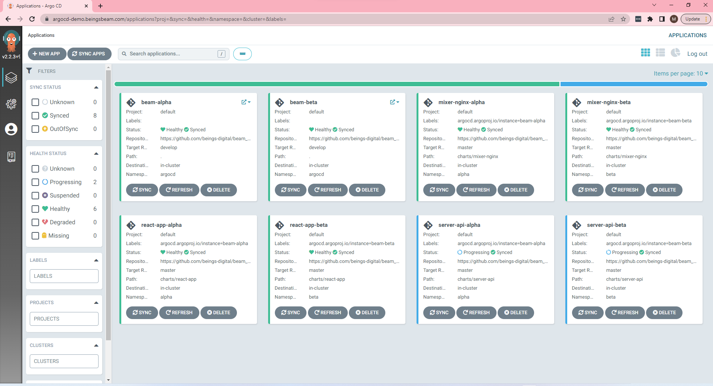
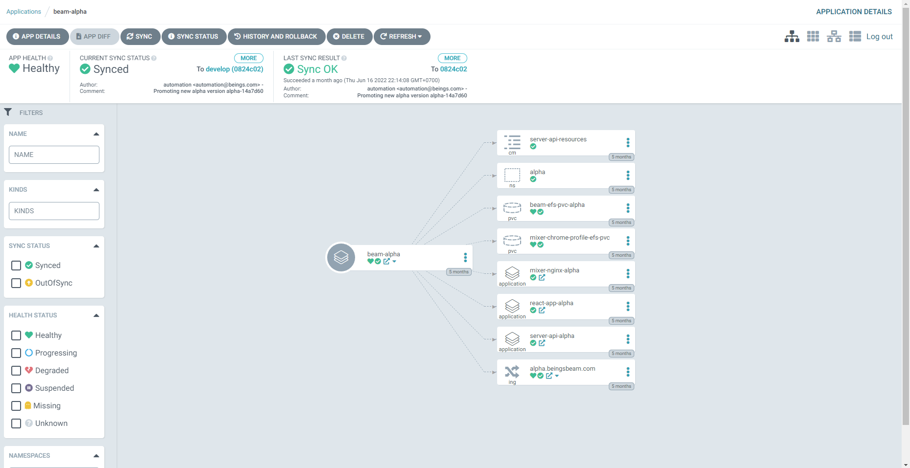
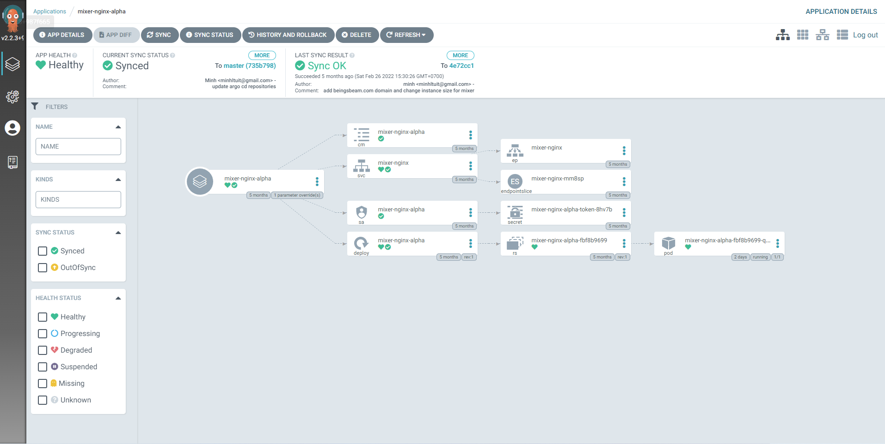
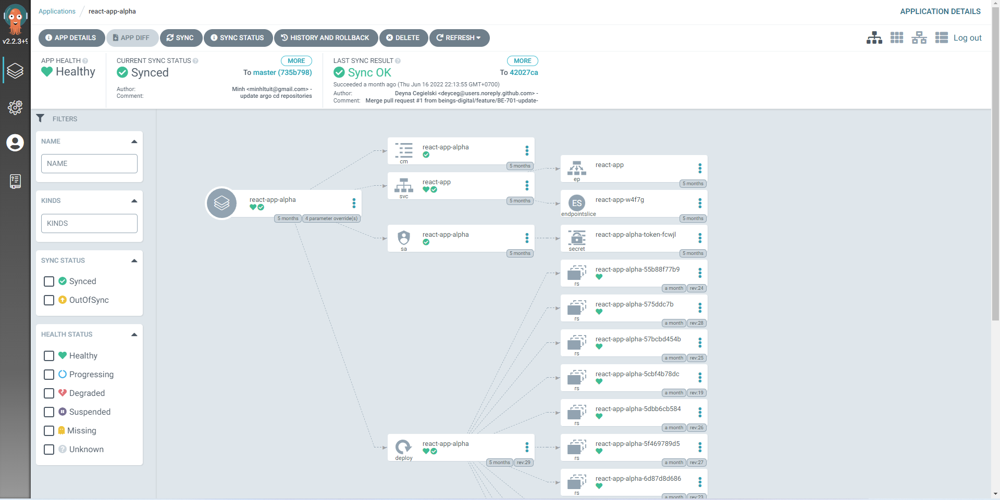

# Argo CD Gitops

## Stragety for Argo CD

Using App of Apps Pattern with 2 repositories

1. First repository is the helm chart for each applications

```
./charts/
├── mixer-nginx -> helm chart for nginx server
│   ├── Chart.yaml
│   ├── charts
│   ├── templates
│   └── values.yaml
├── react-app -> helm chart for react application
│   ├── Chart.yaml
│   ├── charts
│   ├── templates
│   └── values.yaml
└── server-api -> helm chart for server api (Nodejs)
    ├── Chart.yaml
    ├── charts
    ├── templates
    └── values.yaml
```

2. Second repository is the helm chart for root applications

```
./
├── Chart.yaml
├── README.md
├── templates
│   ├── _helpers.tpl
│   ├── beam-efs-pvc.yaml
│   ├── beam-ingress.yaml
│   ├── mixer-nginx.yaml -> Argo CD application for nginx server using helm chart in first repository
│   ├── namespaces.yaml
│   ├── react-app.yaml -> Argo CD application for react application using helm chart in first repository
│   └── server-api.yaml -> Argo CD application for server api (Nodejs) using helm chart in first repository
├── values.alpha.yaml -> values for alpha environment
├── values.beta.yaml -> values for beta environment
└── values.yaml
```

## Demo







